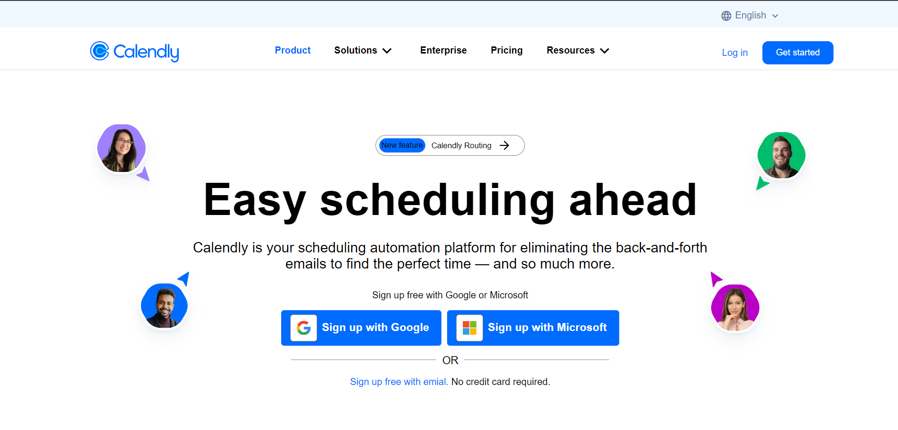
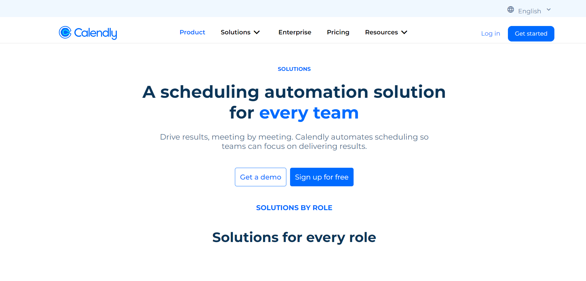
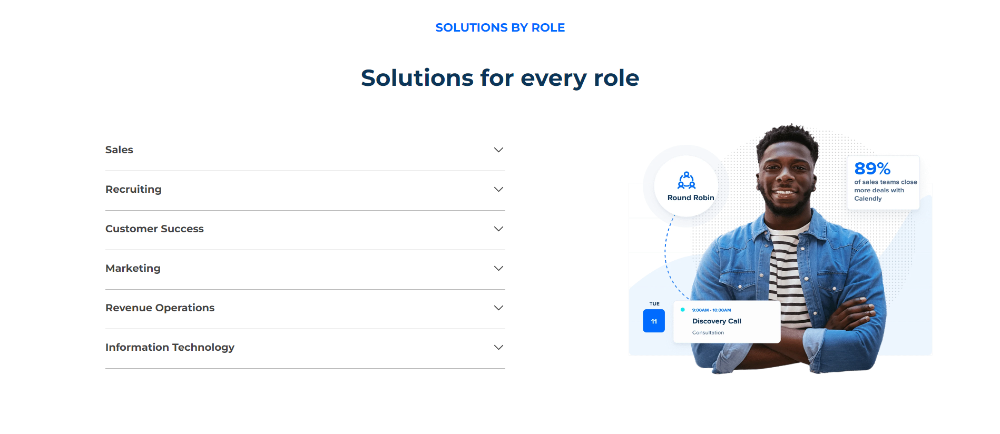
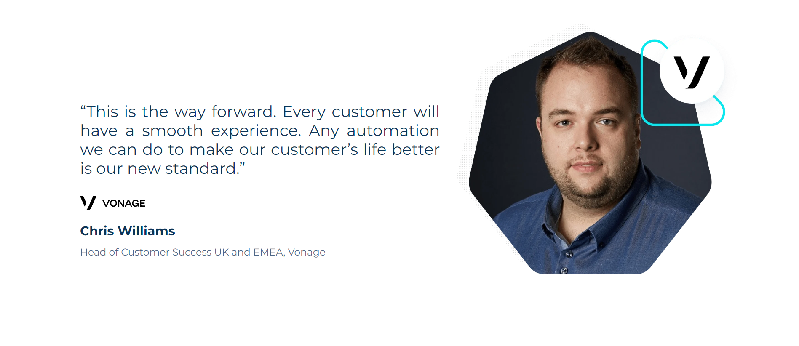
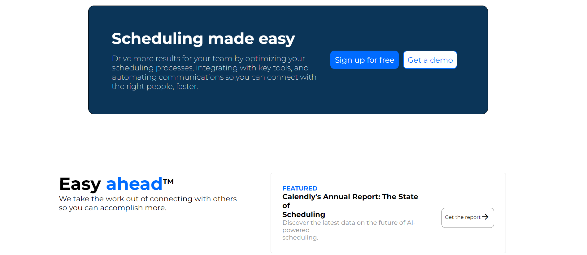
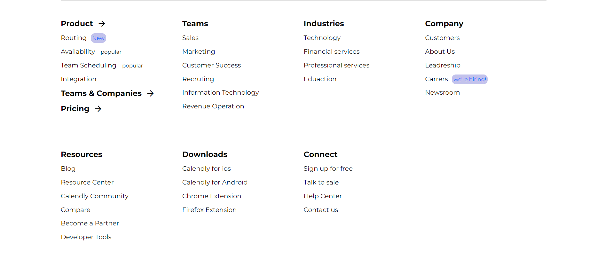

# CALENDLY SITE UI CLONE 🚀

### Team Members

1. Ajay (Captain) ⚓️
2. Avishek 😊
3. Manish 🎩
4. Pushkin 📚
5. Umer 🌟
6. Karndip 🛠️

## SOLUTIONS Page in Calendly Site is Design by me! 😊🚀

## Calendly Site Solutions Section!

### File Structure

- solutions.html: The main HTML file containing the structure of the webpage.
- solutions.css: The stylesheet file for styling the webpage.
- README.md: Documentation file for the project.

## Technologies Used

- 💻 HTML: Structuring the project's UI for optimal display.

- 🎨 CSS: Styling elements to create a responsive interface.

- 🚀 JavaScript: Implementing dynamic functionality, including animation using Animated On Scroll Library AOS Library

## HTML Tags used

### Semantic HTML Tags:

- **Header, nav, main, section, article, footer** : Structure content meaningfully.
- **h1, h2, h3** : Define headings.
- **p** : Denote paragraphs.
- **a** : Create hyperlinks.
- **img** : Insert images.
- **button** : Design clickable buttons.
- **span** : Style inline elements.

### Non-Semantic HTML Tags:

- **div** : Acts as a generic container.
- **i** : Typically used for icons or styling.
- **sup** : Represents superscript text.
- **svg** : Defines scalable vector graphics.
- **script** : Embeds JavaScript code.
- **style** : Holds CSS styling rules.

### External Packages

- 🎭 [AOS Library ](https://github.com/michalsnik/aos)for animations

## Development Stack

- 🌐 HTML and 🎨 CSS for structuring and styling web content.
- 🎭 AOS Library for captivating animations.

## Features

- 📱 Fully Responsive: All pages are designed to provide a seamless experience across various devices.
- 🚀 Scroll Animations: Applied animations to the home page using the AOS Library, triggering effects as you scroll.

## Learning and Insights

- 🚀 Animation with AOS Library: Learned to enhance user experience by incorporating animations using the AOS Library.
- 🌐 Responsive Design: Gained expertise in making web pages fully responsive for a seamless user experience across various devices.
- 🔧 Browser Dev Tools: Improved proficiency in utilizing browser developer tools for better debugging and optimization.
- 📏 Relative Units: Recognized the importance of using relative units for creating responsive web pages.

## Screenshots

### Home Page

### Solution Page

